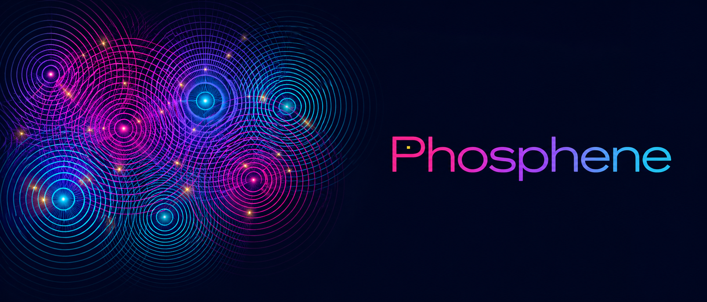
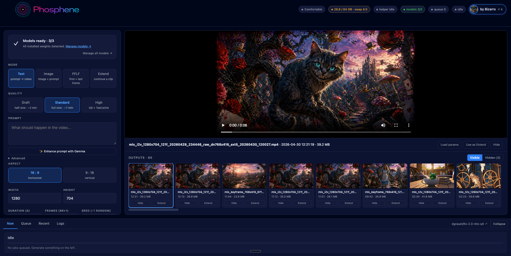
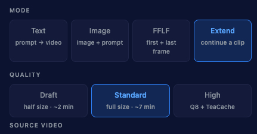

<p align="center">
  
</p>

<p align="center">
  <strong>Local video and audio generation for Apple Silicon.</strong><br>
  A free desktop panel for <a href="https://github.com/Lightricks/LTX-Video">LTX 2.3</a> running natively in <a href="https://github.com/ml-explore/mlx">MLX</a>.<br>
  One-click install via <a href="https://pinokio.computer">Pinokio</a>. No cloud, no API key, no subscription.
</p>

<p align="center">
  <a href="https://x.com/AIBizarrothe">
    
  </a>
  <br>
  <em>by <a href="https://x.com/AIBizarrothe">Mr. Bizarro</a> on X</em>
</p>

---

> ### ⚠ Pinokio Update silently doing nothing?
>
> A one-time history scrub on 2026-05-01 left some clones unable to
> fast-forward to current main, so Pinokio's Update appears to fire
> but nothing changes. **Just reinstall** — that's the cleanest fix:
>
> 1. In Pinokio: **Reset** the Phosphene panel.
> 2. **Install** it again.
>
> Yes, this re-downloads the LTX weights (~36 GB). Annoying but quick on
> a decent connection, and from this point on Pinokio's Reset preserves
> your models because `install.js` declares an `fs.link` persistent drive
> (Y1.004+). So this is a one-time inconvenience for clones that pre-date
> 2026-05-01; future Reset → Install is fast and lossless.
>
> If you'd rather not re-download, the repo includes a `recover.sh` that
> resets the git repo to current main without touching your `mlx_models/`.
> See its header comment for usage. (Most users: just reinstall.)

---

## What it looks like

<p align="center">
  
</p>

Single page, no node graph. Pick a mode, type a prompt, hit Generate.
Outputs land in the gallery on the right. Every clip carries audio.

<p align="center">
  
</p>

---

## What's different

The differentiator is **audio**. LTX 2.3 generates video and audio in
**one forward pass** — they share the diffusion process, so timing is
tied at the frame level. Footsteps land on the right frame. Lip
movement matches dialogue. Ambient hum is conditioned on what you see.

| | Phosphene | Wan / Hunyuan / Mochi (Mac) | Pika / Runway | ComfyUI + LTX 2.3 |
|---|---|---|---|---|
| Joint audio + video | ✅ one pass | ❌ silent | ✅ (cloud) | ✅ |
| Native MLX (no torch shim) | ✅ | ❌ MPS shim | n/a | ❌ |
| Local, no API | ✅ | ✅ | ❌ | ✅ |
| One-click install | ✅ Pinokio | varies | n/a | ❌ node graph |
| Persistent batch queue | ✅ crash-resume | ❌ | ✅ | ❌ |
| Lossless H.264 output | ✅ yuv444p crf 0 | yuv420p | varies | yuv420p |

---

## Modes

Four generation modes. All produce video + synced audio.

| Mode | Inputs | Use case |
|---|---|---|
| **T2V** — text → video | prompt | The default. Type a scene, get 5 seconds with sound. |
| **I2V** — image → video | prompt + reference image | Animate a still. Auto cover-crop to model dimensions. |
| **FFLF** — first / last frame | prompt + start image + end image | Two images bookend the clip; the model fills the motion between. Requires Q8. |
| **Extend** — continue a clip | existing mp4 + prompt | Append seconds onto a previous render. Audio continuous across the join. Requires Q8. |

Plus a **Prompt Enhance** button that uses Gemma 3 12B (4-bit, locally)
to rewrite your prompt in the structure LTX 2.3 was trained on.

---

## Quality tiers

Four render levels picked per-job. All use the same prompt; the model
and step count change.

| Tier | Model | Default size / time | Use case |
|---|---|---|---|
| **Quick** | Q4 distilled | 640×480 · ~2 min | Fast sanity checks. 4:3 native output. |
| **Balanced** | Q4 distilled + Lanczos export | 1024×576 → 1280×720 · ~4–5 min | Default. Standard 16:9 delivery without cropping; good first bet for faster HD-looking clips. |
| **Standard** | Q4 distilled | 1280×704 · ~8 min | The daily driver. Q4 weights (~20 GB on disk). Boost/Turbo Speed shaves ~23 % / ~34 %. |
| **High** | Q8 two-stage + TeaCache | 1280×704 · ~12 min | Sharper detail, fewer artifacts on faces and text. Optional Q8 download (~37 GB extra). Required for FFLF. |

The **Export** control can also run a lightweight ffmpeg Lanczos pass after
generation:

- **Native** writes the generated dimensions unchanged.
- **720p fit** scales into 1280×720 (or 720×1280 vertical) and pads any
  remainder. It never crops or distorts; 1024×576 fills exactly.
- **2×** doubles the generated width and height while preserving the exact
  aspect ratio.

Exported/upscaled files use the same **Output format** setting as native
renders. Standard stays compact (`yuv420p` / CRF 18); Video production stays
lossless (`yuv444p` / CRF 0).

The **Fast** export method uses ffmpeg Lanczos. The optional **Sharp** export
method uses PiperSR, a lightweight Apple Neural Engine 2× post-upscaler, then
ffmpeg handles the final fit/pad/encode step. It is not bundled in the default
install because PiperSR has separate AGPL/model-license terms; install it from
the Pinokio menu only if those terms work for you. The old experimental LTX
latent x2 upscaler can still be forced with `LTX_ENABLE_MODEL_UPSCALE=1`, but it
is hidden by default: the official LTX upscaler is meant to be followed by a
second-stage denoise/refinement pass, and direct decode distorted faces in
release tests.

Dev builds also include a PiperSR comparison tool for testing Sharp against
Lanczos on any existing clip:

```bash
ltx-2-mlx/env/bin/python scripts/upscale_compare_pipersr.py path/to/input.mp4
```

Standard T2V/I2V also has an opt-in **Speed** control:

- **Exact** is the default full sampler.
- **Boost** skips up to two stable middle denoise calls.
- **Turbo** skips up to three stable middle denoise calls.

Boost/Turbo are experimental acceleration modes. They keep the same
prompt, seed, dimensions, and output format, but they are not bit-for-bit
or visually identical to Exact. They are disabled for High, Extend, and
FFLF. The sampler keeps the first two steps and final third of the
schedule exact, so the cached steps stay in the middle where speed wins
are least likely to soften hands, faces, and typography. Per-render
sidecars record the cached/full step counts for debugging and comparison.

---

## Hardware tiers

The panel detects your Mac's RAM at boot and gates features to fit.
Apple Silicon only — no Intel, no Linux, no Windows path. MLX is
Apple-only by design.

| RAM | Tier | What runs |
|---|---|---|
| < 48 GB | Compact | T2V / I2V at smaller dimensions (≤ 768 long-side) |
| 48–79 GB | Comfortable | Full 1280×704 at all modes — the canonical tier (M-Studio 64 GB) |
| 80–119 GB | Roomy | Longer clips, full Q8, FFLF unrestricted |
| ≥ 120 GB | Studio | No clamps |

LTX 2.3's working memory is real — there is no shortcut around it.
Standard 1280×704 generation peaks around 22 GiB resident; High mode
with the Q8 dev transformer (~19 GiB on disk) is closer to 38 GiB.
The tier system enforces this honestly instead of letting you queue
jobs that fall out of the OOM killer.

---

## Install

### Option A — Pinokio one-click (recommended)

1. Open Pinokio.
2. **Discover → Download from URL** → paste
   `https://github.com/mrbizarro/phosphene`
3. Click **Install**. Pinokio handles the rest:
   - Apple Silicon hardware gate
   - Clones [`dgrauet/ltx-2-mlx`](https://github.com/dgrauet/ltx-2-mlx),
     creates a Python 3.11 venv via `uv`, installs the MLX pipelines
     at the locked versions
   - Applies the codec + memory-overlap patches (idempotent, fails
     loud on upstream drift)
   - Downloads Q4 model (~20 GB) + Gemma encoder (~7.5 GB) via `hf
     download` — resumable, filtered to only the files the panel loads
4. Click **Start** → **Open Panel** → http://127.0.0.1:8198

For the High quality tier (Q8 two-stage + TeaCache), download the Q8
model afterward via the **Download Q8** button in the panel sidebar
(one-time, ~37 GB extra).

### Faster downloads (recommended for Q8)

Hugging Face throttles unauthenticated downloads. With a token,
downloads run **~10× faster** — particularly relevant for the optional
37 GB Q8 model.

Two options, no terminal required for either:

1. **In-app**: open ⚙ Settings in the panel and paste your HF token
   into the *Hugging Face token* field. Get a token at
   [huggingface.co/settings/tokens](https://huggingface.co/settings/tokens)
   (read access is enough). The same token unlocks gated LoRAs (HDR
   and the Lightricks Control LoRAs).
2. **Terminal**: `hf auth login` once and paste the token. The `hf`
   binary inside Pinokio's install reads the same cached token file.

### Option B — manual

```bash
# 1. Clone this panel
git clone https://github.com/mrbizarro/phosphene.git
cd phosphene

# 2. Clone ltx-2-mlx alongside (default panel layout assumes ./ltx-2-mlx/)
git clone https://github.com/dgrauet/ltx-2-mlx.git ltx-2-mlx
cd ltx-2-mlx
uv venv --python 3.11 --seed env
./env/bin/pip install ./packages/ltx-core-mlx ./packages/ltx-pipelines-mlx
./env/bin/pip install pillow numpy 'huggingface-hub>=1.0' \
  'mlx==0.31.1' 'mlx-lm==0.31.1' 'mlx-metal==0.31.1'
cd ..

# 3. Apply patches (codec + memory-overlap)
./ltx-2-mlx/env/bin/python3.11 patch_ltx_codec.py

# 4. Run the panel
./ltx-2-mlx/env/bin/python3.11 mlx_ltx_panel.py
# → http://127.0.0.1:8198
```

> **Why the version pins?** `mlx 0.31.2` introduced a numerical change
> that attenuates the LTX 2.3 vocoder output by ~22 dB (verified
> empirically: same prompt + seed + weights → -42 dB peak on 0.31.2 vs
> -9 dB peak on 0.31.1). Pinning to 0.31.1 is the recovery. See
> `CLAUDE.md` for the full version-pin rationale.

---

## LoRAs

LTX 2.3 supports LoRA adapters — small files that fuse into the model
weights to add a style, effect, or specialization. Phosphene exposes
them three ways:

### HDR — one-click toggle

The official Lightricks **HDR** LoRA is exposed as a plain toggle in
the form (next to *Enhance with Gemma*). Click it on, generate. First
HDR job triggers a one-time ~330 MB download of the LoRA weights from
Hugging Face; subsequent jobs share the cache.

The HDR LoRA is **gated** — you'll need to accept Lightricks' license
at https://huggingface.co/Lightricks/LTX-2.3-22b-IC-LoRA-HDR and have
a Hugging Face token. Open ⚙ Settings in the panel and paste your token
into the *Hugging Face token* field (get one at
[huggingface.co/settings/tokens](https://huggingface.co/settings/tokens),
read access is enough). No terminal, no env vars.

### Custom LoRAs from disk

Drop any `.safetensors` LoRA into `mlx_models/loras/` and it appears
in the LoRA picker (collapsible section above the prompt). Each row
gets an enable checkbox + strength slider (-2.0 to 2.0, clamped).

Optional sidecar metadata: a `<name>.json` next to the `.safetensors`
carries `name`, `description`, `trigger_words`, `recommended_strength`,
and a `preview_url`. The CivitAI installer below writes these
automatically.

### CivitAI browser

Built into the LoRA picker: **Browse CivitAI** opens a modal that
searches CivitAI filtered to `LTXV 2.3` LoRAs. Click Install on a
card → downloads into `mlx_models/loras/` + writes the sidecar.

CivitAI requires an API token for downloads as of 2025. Open ⚙ Settings,
paste your token into the *CivitAI API key* field (get one at
[civitai.com/user/account](https://civitai.com/user/account) → Account
→ API Keys → Add). Stored locally in `panel_settings.json` and never
sent anywhere except CivitAI itself.

### How fusion works

LoRAs are fused into the transformer weights at pipeline load time.
This is *weight-level* fusion, not a runtime adapter — switching the
LoRA set forces a pipeline reload (~30s on a cold cache, instant on a
warm one). The panel detects no-op LoRA changes and reuses the cached
pipeline when the set is the same.

Strengths beyond ±1.5 are unusual and may produce numerical artifacts
in the fused weights; the panel clamps to ±2.0 as a safety rail.

---

## Prompting for sound

LTX 2.3 conditions audio on prompt content. A visual-only prompt
produces near-silent ambient. A prompt with explicit audio cues
produces layered foreground sound.

| Prompt | Audio result |
|---|---|
| `"wizard in a forest"` | quiet room tone |
| `"wizard in a forest — low whispered chant, ember crackle, distant owl"` | audible chant + crackle + owl, all timed to the visuals |

**Pro tip:** describe the soundscape the same way you describe the
scene. Voice quality first ("clear, confident voice"), specific sound
events, then ambient. The Prompt Enhance button enforces this
structure automatically.

If you don't want music in the output (because music is hard to
remove cleanly in post), toggle the **🚫 No music** pill next to
Enhance — it appends an audio constraint to the prompt at submit time.

The optional **Avoid** field is stored separately in sidecars. On Q4
Quick/Balanced/Standard it is folded into the prompt as avoid terms because
that distilled path runs without CFG. On High / FFLF / Extend paths it extends
the native CFG negative prompt used by the upstream pipeline.

---

## Output format

Pick a preset from the **⚙ Settings** modal in the panel header. Three
built-ins, plus a Custom mode for advanced overrides:

| Preset | pix_fmt | CRF | ~Size (5s @ 1280×704) | Use case |
|---|---|---|---|---|
| **Standard** ⭐ default | yuv420p | 18 | ~7 MB | Visually lossless to most viewers. Plays everywhere — X, Instagram, Discord. The default for new installs. |
| **Video production** | yuv444p | 0 | ~50 MB | Mathematically lossless, full 4:4:4 chroma. For color grading, compositing, VFX — workflows that re-encode downstream and need every frame intact. |
| **Web** | yuv420p | 23 | ~3 MB | Smallest files. For mobile, embedding, or quick previews. |
| **Custom** | choose | 0–30 | varies | 10-bit HDR, format-specific delivery, etc. |

Settings persist to `panel_settings.json` and apply to every new
render. The helper subprocess restarts automatically when you change
codec settings, so the change takes effect on the next render.

**`+faststart`** is always on, regardless of preset. The `moov` atom
sits at the front of the file so gallery thumbnails render the first
frame instantly without downloading the full clip.

For social uploads (X especially rejects `yuv444p`), re-encode with:

```bash
ffmpeg -i in.mp4 \
  -c:v h264_videotoolbox -profile:v high -pix_fmt yuv420p \
  -b:v 8M -maxrate 12M -bufsize 16M \
  -movflags +faststart \
  -c:a aac -b:a 192k \
  out.mp4
```

---

## Performance reference

Wall-clock times on an **M4 Mac Studio, 64 GB**:

| Mode | Resolution | Frames | Steps | ~Time |
|---|---|---|---|---|
| T2V Quick | 640×480 | 121 (5s) | 8 | ~2 min |
| T2V Standard | 1280×704 | 121 (5s) | 8 | ~7 min |
| I2V Standard | 1280×704 | 121 (5s) | 8 | ~7 min |
| Extend (Q4 dev, cfg=1.0) | 768×416 | +6 latents (~2s) | 12 | ~12 min |
| Extend (Q4 dev, cfg=3.0 "Quality") | 1280×704 | +6 latents | 12 | ~30 min |
| High (Q8 two-stage) | 1280×704 | 121 | s1=15 + s2=3 | ~12 min |
| FFLF (Q8) | 768×416 | 121 | s1=15 + s2=3 | ~5 min |

Experimental Speed smoke test on the same 64 GB machine, I2V Standard,
768×512, 121 frames, 8 steps:

| Speed | Time | Notes |
|---|---:|---|
| Exact | 186 s | Full sampler |
| Boost | 145 s | 2 cached denoise calls |
| Turbo | 126 s | 3 cached denoise calls |

M-Max divides by ~3×. M-Ultra by ~6×. Compact tier (< 48 GB) takes
roughly 2× longer at clamped resolutions because of swap pressure.

---

## Configuration via env vars

Every path is overridable. Defaults are auto-detected.

| Env var | Default | What |
|---|---|---|
| `LTX_PORT` | `8198` | Panel HTTP port |
| `LTX_MODEL` | `dgrauet/ltx-2.3-mlx-q4` | Q4 model path or HF id |
| `LTX_MODEL_HQ` | `mlx_models/ltx-2.3-mlx-q8` | Q8 model path |
| `LTX_GEMMA` | `mlx-community/gemma-3-12b-it-4bit` | Gemma encoder path or HF id |
| `LTX_HELPER_PYTHON` | `ltx-2-mlx/env/bin/python3.11` | Python that runs the helper |
| `LTX_HELPER_IDLE_TIMEOUT` | `1800` | Helper auto-exits after this many seconds idle |
| `LTX_LOW_MEMORY` | `true` | Drop pipeline weights between jobs to free RAM |
| `LTX_OUTPUT_PIX_FMT` | `yuv444p` | Output codec pix_fmt |
| `LTX_OUTPUT_CRF` | `0` | H.264 CRF — 0 = lossless |
| `LTX_TIER_OVERRIDE` | _(unset)_ | Force a hardware tier (`base \| standard \| high \| pro`) — testing only |

---

## Credits

This is a wrapper, not a fork. All the hard model work belongs to:

- **[Lightricks](https://github.com/Lightricks/LTX-Video)** — original
  LTX 2.3 model, weights, and joint audio + video architecture
- **[@dgrauet](https://github.com/dgrauet/ltx-2-mlx)** — the MLX
  port (`ltx-2-mlx`). Without their work there is no LTX on Apple
  Silicon worth talking about. Q4 / Q8 quantized weights on Hugging
  Face. Phosphene wraps their package.
- **[Apple ML team](https://github.com/ml-explore/mlx)** — the MLX
  framework that makes Metal-native ML on Mac fast enough to run
  generative video locally
- **[mlx-community](https://huggingface.co/mlx-community)** — the
  Gemma 3 12B 4-bit text encoder distribution
- **[@cocktailpeanut](https://twitter.com/cocktailpeanut)** —
  Pinokio itself, which makes one-click installers like this
  possible
- **[ModelPiper PiperSR](https://github.com/ModelPiper/PiperSR)** —
  optional Sharp export upscaling on Apple Neural Engine

The panel adds: persistent batch queue, warm helper subprocess,
hardware-tier feature gating, lossless H.264 + faststart output,
output gallery with sidecar params, and the Pinokio install scripts.

---

## Known limits

- **Apple Silicon only.** No Intel, Linux, or Windows. MLX is
  Apple-only by design.
- **Memory pressure can SIGKILL the helper** on Macs at full RAM.
  Patches in `patch_ltx_codec.py` reduce peak by ~6 GiB during I2V
  denoise; closing Chrome, Slack, and iOS Simulator before a Standard
  render is the safest single thing a user can do. The panel surfaces
  the exit signal name (SIGKILL / SIGSEGV / SIGABRT) when the helper
  dies non-gracefully so issues are diagnosable.
- **Boost/Turbo are quality trade-offs.** They are useful for fast
  iteration, but Exact remains the default and safest choice for final
  renders, faces, typography, and client work.
- **Localhost only.** The panel binds to `127.0.0.1` with no auth.
  Not designed for LAN exposure or tunneling.
- **A2V (audio → video) not yet wired.** Upstream supports it; the
  panel UI does not expose it. v1.1.

---

## Roadmap

- [ ] A2V mode in the panel (upstream `a2vid_two_stage.py` exists)
- [ ] Pre-flight RAM advisory before submitting heavy jobs
- [ ] In-app HF token field (currently requires `hf auth login` in
      Terminal)
- [ ] Audio mode dropdown: With music / Voice + ambient / SFX-only / Silent
- [ ] Bisect `mlx 0.31.1 → 0.31.2` to identify and file the audio
      regression upstream

---

## License

**Panel:** MIT — see [LICENSE](LICENSE).

**LTX Video 2.3 weights:** Lightricks' own license. Read it before
commercial use.

**MLX framework:** Apache 2.0.

**Gemma 3 12B weights:** Google's terms.

**PiperSR:** code is AGPL-3.0; model usage requires ModelPiper attribution
and may require separate commercial licensing. Review its model license before
commercial redistribution.

**Network note:** Phosphene runs locally and has no telemetry. On clean
production installs it checks GitHub every 30 minutes for an update badge, and
it reaches Hugging Face/CivitAI only when you download models or LoRAs. Disable
the update badge with `PHOSPHENE_DISABLE_VERSION_CHECK=1`.
